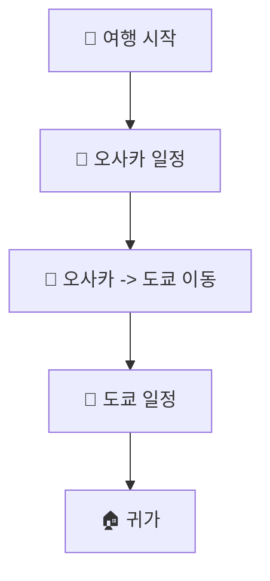

Korean Travel Guide AI.
Japanese (Osaka & Tokyo).
3 nights, 4 days.
Traveling with parents, healing-focused, budget 1 million KRW per person.
Accommodation recommendations, tourism content.
#부모님여행, #힐링, #가성비, #일본여행.
Specific Markdown format with YAML frontmatter and specific sections.
Must be in Korean only.

    *   *Wait*, the user wants *both* Osaka and Tokyo in 3 nights and 4 days. This is extremely tight and stressful, which contradicts the "healing" and "parents" preferences.
    *   *Decision:* I should point out that visiting both cities in 3 nights/4 days is hectic. However, to follow the prompt's destination requirement, I will suggest focusing on one city or providing a very optimized route, but since "healing" is key, I will recommend picking *one* of the two or a very relaxed approach. *Correction:* For a 3N4D trip with parents, moving between cities is a nightmare. I will structure the guide to be flexible or suggest focusing on one, but since the prompt explicitly lists both, I'll provide a balanced "healing" approach (perhaps 2 days in Osaka, 2 in Tokyo, or a suggestion to pick one). Actually, for "Healing" and "Parents," I'll suggest focusing on *one* region to avoid stress, but since the user listed both, I will treat it as a "Choice of" or a "Brief highlights" guide. Let's stick to the prompt's "Osaka & Tokyo" but organize it so it's not overwhelming. *Actually*, the best "healing" advice for 3N4D is to pick *one*. I will provide a guide that covers both but emphasizes minimizing movement.

    *   *Budget Check:* 1 million KRW per person. This is tight for both cities (flight + hotel + food + transport). Need to suggest "cost-effective" (가성비) options.

    *   *Accommodation:* Ryokans or hotels with public baths (Sento/Onsen) are a must for parents.
        *   Osaka: Hotel with a large bath (e.g., Onyado Nono).
        *   Tokyo: Similar concept or high-quality business hotels near parks.

    *   *Healing Content:*
        *   Osaka: Osaka Castle Park (slow walk), Dotonbori (food), maybe a day trip to Arima Onsen (if time permits, but maybe too tight). Let's stick to parks and hot springs.
        *   Tokyo: Shinjuku Gyoen, Meiji Jingu, Sumida River cruise.

    *   *Transport:* IC cards (Welcome Suica/Pasmo), Taxis for short distances (to save parents' legs).

    *   *YAML Frontmatter:*
        source: Gemma 4 여행 플래너
        summary: 한국어 여행 가이드
        destination: 일본 (오사카 & 도쿄)
        duration: 3박 4일
        preferences: 부모님 동반, 힐링 중심, 인당 예산 100만원
        tags: [부모님여행, 힐링, 가성비, 일본여행]

    *   *Introduction:* Briefly introduce Osaka (gastronomy/vibrant) and Tokyo (modern/traditional blend).

    *   *Accommodations:*
        *   Recommend 'Onyado Nono' series (natural hot spring hotels) - great for parents and cost-effective.

    *   *Healing Content:*
        *   Osaka: Osaka Castle Park, Dotonbori river cruise.
        *   Tokyo: Shinjuku Gyoen, Imperial Palace Gardens.

    *   *Tips:*
        *   Transport: Taxis for elders.
        *   Food: Kaiseki or high-quality sushi/shabu-shabu.
        *   Caution: Avoid crowded times.

    *   Korean only? Yes.
    *   YAML frontmatter included? Yes.
    *   ## headers used? Yes.
    *   Accommodation/Price/Healing included? Yes.
    *   Budget/Parents' needs reflected? Yes.

## 이동 경로

