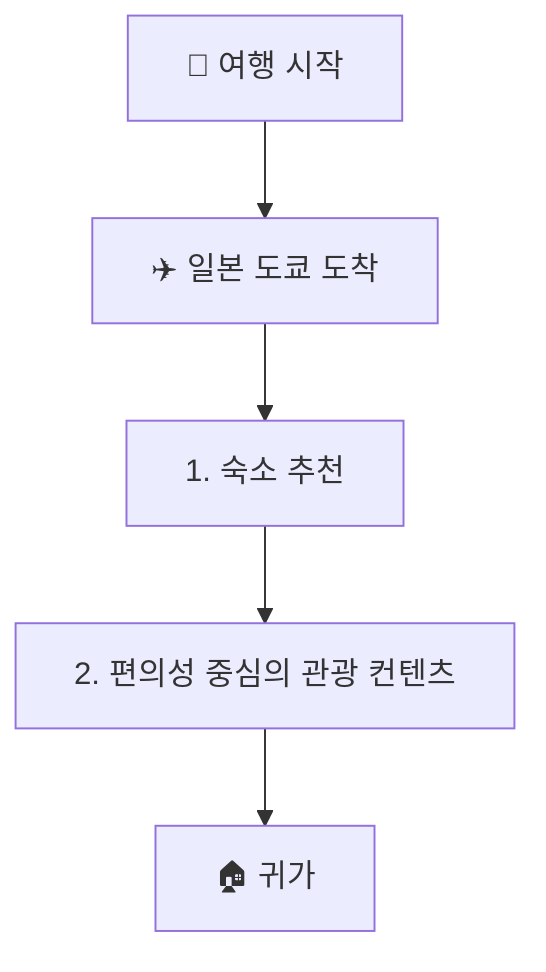

```markdown
---
destination: 일본 도쿄
duration: 3박 4일
preferences: 아버지와 함께하는 여행, 가성비, 힐링, 편의성
budget: 1인당 150만 원
people: 2
tags: [부모님여행, 가성비, 힐링, 편의성]
---

## 서론
이 여행 가이드는 부모님과 함께하는 편안하고 편리한 도쿄 여행을 위해 특별히 설계되었습니다. 붐비는 관광 명소나 빡빡한 일정보다는 '힐링', 접근성, 그리고 가성비를 우선시했습니다. 목표는 도쿄의 정수를 경험하면서 걷는 피로를 최소화하고 편안함을 극대화하는 것입니다.

## 숙소 추천
부모님과의 여행에서는 호텔의 위치가 가장 중요한 요소입니다. **우에노 또는 아사쿠사 지역**에 머무시는 것을 추천합니다.

*   **왜 우에노/아사쿠사인가요?**
    *   **공항 접근성:** 나리타 공항에서 스카이라이너를 통해 직통으로 연결되어 이동 시간과 스트레스를 줄일 수 있습니다.
    *   **분위기:** 신주쿠나 시부야보다 대체로 차분하며, 더 전통적이고 평화로운 분위기를 제공합니다.
    *   **편의성:** 평탄한 산책로가 많고 대형 공원과 가깝습니다.
*   **추천 호텔 유형:**
    *   **비즈니스 호텔 (예: 미쓰이 가든 호텔 또는 APA 호텔):** 가성비와 청결함의 균형이 매우 좋습니다. 성인 두 명이 충분한 공간과 편안함을 누릴 수 있도록 '트윈 룸'을 선택하세요.
    *   **예산 팁:** 아버지의 도보 이동 거리를 최소화하기 위해 역에서 도보 5분 거리 내의 호텔을 예약하는 것을 강력히 추천합니다.

## 힐링 및 편의 중심 활동
일정은 넓은 환경과 스트레스 없는 이동에 중점을 두었습니다.

### 1일 차: 여유로운 도착 및 주변 탐방
*   **도착:** 스카이라이너를 타고 우에노역으로 이동합니다.
*   **체크인:** 호텔에 짐을 풀고 휴식을 취합니다.
*   **저녁 산책:** 호텔 주변을 가볍게 산책합니다. 현지 와쇼쿠(일본 전통 요리) 식당에서 조용한 저녁 식사를 하며 편안하게 여행을 시작하세요.

### 2일 차: 자연과 전통
*   **우에노 공원:** 천천히 걷기에 완벽한 넓고 평탄한 지역입니다. 도쿄 국립 박물관을 방문하거나 단순히 풍경을 즐겨보세요. 서두르지 않고 '힐링'하기에 아주 좋은 장소입니다.
*   **아사쿠사 (센소지):** 도쿄의 전통적인 면모를 경험해 보세요. 편의를 위해 탐방 중 일부 구간은 인력거 투어를 이용하여 장거리 도보 이동을 피하세요.
*   **식사:** 영양가와 맛이 뛰어나 부모님들이 일반적으로 선호하시는 고품질의 텐푸라(튀김)나 우나기(장어) 요리를 드셔보세요.

### 3일 차: 도심 속 오아시스와 도시 전망
*   **신주쿠 교엔 국립정원:** 도쿄에서 가장 아름답고 평화로운 정원 중 하나입니다. 넓은 산책로와 푸른 녹음이 완벽한 힐링 환경을 제공합니다.
*   **도쿄 도청사:** 무료 전망대를 방문하세요. 다른 타워들처럼 비싼 티켓 가격이나 긴 대기 줄 없이도 멋진 도시 전망을 감상할 수 있습니다.
*   **저녁:** 편안한 발 마사지를 받거나 조용한 카페를 방문하여 긴장을 푸세요.

### 4일 차: 여유로운 쇼핑 및 출국
*   **백화점 쇼핑:** 다카시마야나 이세탄 같은 백화점을 방문하세요. 이런 곳들은 엘리베이터, 화장실, 휴게 공간이 잘 갖춰져 있어 붐비는 거리 시장보다 부모님께서 이용하시기에 훨씬 편리합니다.
*   **출국:** 스카이라이너를 타고 공항으로 이동합니다.

## 부모님을 위한 여행 팁

### 1. 교통 전략
*   **단거리 택시 이용:** 도쿄의 지하철 시스템은 훌륭하지만, 노선 간 환승 시 많이 걸어야 할 수 있습니다. 아버지의 체력을 아끼기 위해 관광지 간 짧은 거리는 택시(또는 GO/Uber 같은 앱)를 이용하세요.
*   **IC 카드:** 키오스크에서 매번 티켓을 구매하는 번거로움을 피하기 위해 웰컴 스이카(Welcome Suica)나 파스모(Pasmo) 카드를 사용하세요.

### 2. 예산 관리 (1인당 150만 원)
*   **항공 및 호텔:** 약 60만 원 ~ 80만 원을 배정하세요.
*   **식사:** 하루 1~2끼의 고품질 '특식'과 간단하고 건강한 아침 식사에 집중하세요.
*   **교통비:** 비용 절감보다는 편의성을 우선하여 택시비를 추가로 책정하세요.

### 3. 부모님을 위한 배려 사항
*   **휴식 시간:** 피로를 방지하기 위해 2시간마다 '카페 휴식' 시간을 일정에 넣으세요.
*   **메뉴 선택:** 너무 실험적인 음식은 피하고 초밥, 스키야키, 돈카츠와 같은 고품질의 기본 메뉴를 선택하세요.
*   **속도 조절:** 일정을 유연하게 유지하세요. 아버지가 피곤해하신다면, 관광지 한 곳을 생략하고 호텔에서 쉬는 것이 더 좋습니다.
```

## 이동 경로


