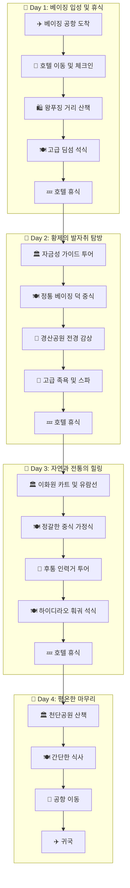

```yaml
destination: 중국 베이징
duration: 3박 4일
preferences: 부모님 동반, 힐링, 편의성, 효율적인 동선
budget: 인당 200만원
people: 2
tags: [부모님여행, 힐링, 미식, 효율적동선, 인당 200만원]
```

# 🇨🇳 부모님과 함께하는 베이징 힐링 여행 가이드

부모님과의 여행에서 가장 중요한 것은 **'여유로운 일정'**과 **'편안한 이동'**입니다. 너무 많은 곳을 방문하기보다, 베이징의 정수를 느낄 수 있는 핵심 명소 위주로 동선을 최적화하고, 최고급 숙소와 미식을 통해 효도 여행의 가치를 높인 일정입니다.

---

## 🏯 목적지 소개
베이징은 중국의 정치, 문화, 교육의 중심지로, 거대한 황궁과 현대적인 마천루가 공존하는 도시입니다. 특히 부모님 세대에게는 자금성, 이화원과 같은 역사적 상징물들이 큰 감동을 줍니다. 이번 여행은 걷는 거리를 최소화하고, 쾌적한 이동 수단(디디추싱/전용차량)을 활용하여 '쉼'이 있는 여행으로 구성했습니다.

---

## 🗓️ 추천 일정

### 1일차: 베이징 입성 및 휴식 (적응기)
*   **오후: 베이징 도착 및 호텔 체크인**
    *   공항에서 호텔까지는 **픽업 서비스** 또는 **디디추싱(Didi)** 프리미엄 차량을 이용하여 편안하게 이동합니다.
*   **저녁: 왕푸징 거리 산책 및 석식**
    *   호텔 인근의 왕푸징 거리에서 가볍게 구경하며 베이징의 분위기를 느낍니다.
    *   **식사:** 호텔 내 중식당 또는 인근의 고급 딤섬 전문점에서 자극적이지 않은 식사.
*   **일정 포인트:** 첫날은 무리하지 않고 시차 및 환경 적응에 집중하며 일찍 휴식합니다.

### 2일차: 황제의 발자취를 따라서 (역사 탐방)
*   **오전: 자금성 (Forbidden City)**
    *   세계 최대 규모의 궁전입니다. 부모님의 체력을 고려해 **전문 가이드 투어**를 신청하여 핵심 동선만 효율적으로 관람하세요.
*   **점심: 정통 베이징 덕 (Peking Duck)**
    *   **추천 맛집:** '다동(Da Dong)' 또는 '전취덕(Quanjude)'. 바삭한 껍질과 부드러운 살코기로 부모님 입맛을 사로잡을 베이징 대표 요리입니다.
*   **오후: 경산공원 (Jingshan Park)**
    *   자금성 바로 뒤편에 위치해 있습니다. 낮은 언덕 위로 올라가면 자금성 전체 전경을 한눈에 내려다볼 수 있어 만족도가 매우 높습니다.
*   **저녁: 호텔 내 스파 또는 족욕**
    *   많이 걸으신 부모님을 위해 고급 족욕 샵이나 호텔 스파에서 피로를 풀어드립니다.

### 3일차: 자연과 전통의 조화 (힐링 데이)
*   **오전: 이화원 (Summer Palace)**
    *   중국 최대의 황실 정원입니다. 넓은 부지이므로 **전동 카트**를 이용하여 이동하고, 쿤밍호에서 **유람선**을 타며 여유롭게 풍경을 감상합니다.
*   **점심: 이화원 인근 정갈한 가정식**
    *   자극적이지 않은 채소 요리와 생선 요리 중심의 중식 코스.
*   **오후: 난뤄구샹 & 후통 인력거 투어**
    *   베이징의 옛 골목 '후통'을 **인력거**를 타고 한 바퀴 돕니다. 걷지 않고도 옛 베이징의 정취를 느낄 수 있어 부모님들이 가장 선호하시는 코스입니다.
*   **저녁: 고급 광둥 요리 또는 훠궈**
    *   **추천:** '하이디라오' (최고의 서비스로 부모님께 대접받는 기분을 선사합니다).

### 4일차: 평온한 마무리 및 귀국
*   **오전: 천단공원 (Temple of Heaven)**
    *   아침 일찍 방문하여 현지 어르신들이 제기차기, 태극권을 하는 평화로운 풍경을 감상하며 가볍게 산책합니다.
*   **점심: 간단한 현지식 또는 카페 타임**
    *   현대적인 베이징의 카페 거리에서 여유로운 티타임을 가집니다.
*   **오후: 공항 이동 및 출국**

---

## 🏨 숙박 추천

부모님 동반 여행이므로 **접근성, 조식 퀄리티, 서비스**가 검증된 5성급 호텔을 추천합니다.

*   **추천 호텔: 더 페닌슐라 베이징 (The Peninsula Beijing) 또는 월도프 아스토리아 (Waldorf Astoria)**
    *   **이유:** 왕푸징 중심가에 위치하여 이동 동선이 매우 짧고, 서비스 수준이 세계 최고 수준입니다. 객실 상태가 쾌적하며 조식이 훌륭해 부모님께서 만족하시기에 최적입니다.
    *   **특징:** 한국어 가능 직원이 있거나 영어 소통이 원활하며, 룸서비스 퀄리티가 높아 호텔 내에서의 휴식만으로도 힐링이 됩니다.

---

## 💰 예산 안내 (2인 기준)

인당 200만원(총 400만원)의 예산은 베이징에서 매우 여유롭게 사용할 수 있는 금액입니다.

| 항목 | 예상 비용 (2인 합계) | 비고 |
| :--- | :--- | :--- |
| **항공권** | 약 100 ~ 140만원 | 국적기(대한항공/아시아나) 기준 |
| **숙소 (3박)** | 약 120 ~ 150만원 | 5성급 럭셔리 호텔 |
| **식비** | 약 60 ~ 80만원 | 베이징 덕, 고급 레스토랑 포함 |
| **교통비** | 약 30 ~ 40만원 | 전 일정 디디추싱(프리미엄) 및 픽업 |
| **입장료 및 투어** | 약 30 ~ 40만원 | 가이드 투어, 인력거, 유람선 등 |
| **예비비/쇼핑** | 약 30 ~ 50만원 | 기념품 및 기타 비용 |
| **총계** | **약 370 ~ 450만원** | 인당 약 185~225만원 수준 |

---

## 💡 여행 팁

1.  **필수 앱 설치:**
    *   **Alipay / WeChat Pay:** 중국은 현금 사용이 거의 없습니다. 반드시 카드를 연동한 결제 앱을 준비하세요.
    *   **디디추싱 (DiDi):** 택시 호출 앱입니다. 부모님과 함께라면 무조건 차량 호출 서비스를 이용하세요.
    *   **고덕지도 (Amap) 또는 바이두지도:** 구글 지도는 정확하지 않습니다.
2.  **비자 확인:** 중국 방문을 위한 **비자 발급**을 잊지 마세요. (최근 무비자 정책 여부를 최신 정보로 확인하시기 바랍니다.)
3.  **건강 관리:**
    *   베이징은 공기가 건조할 수 있으므로 **휴대용 가습기나 마스크**, 그리고 부모님을 위한 **상비약**을 넉넉히 챙기세요.
    *   따뜻한 물을 선호하시는 부모님을 위해 **보온병**을 지참하는 것을 추천합니다.
4.  **예약 필수:** 자금성은 예약제로 운영되며 매진이 빠릅니다. 여행 확정 즉시 공식 채널을 통해 예약하시기 바랍니다.

## 이동 경로


